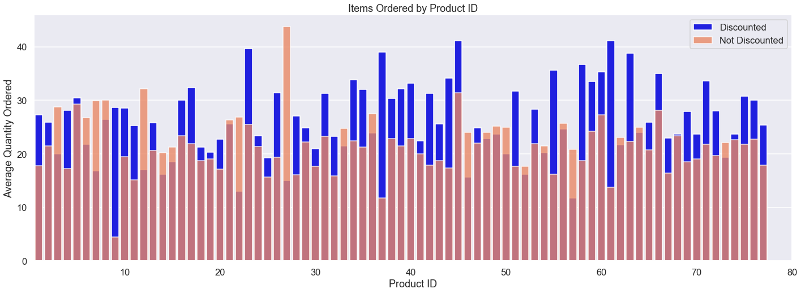
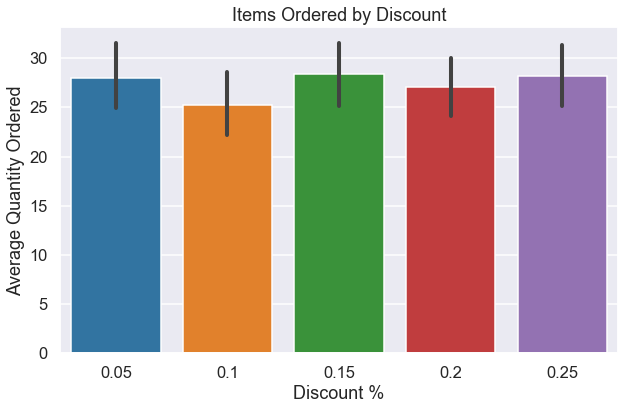
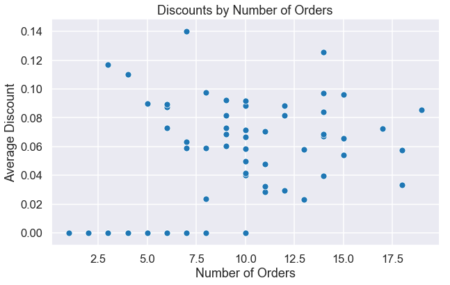
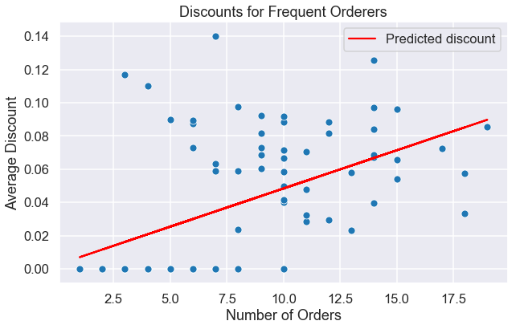
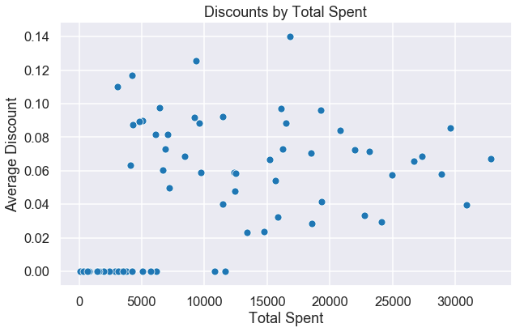
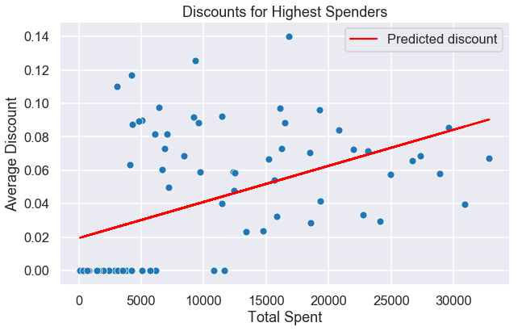
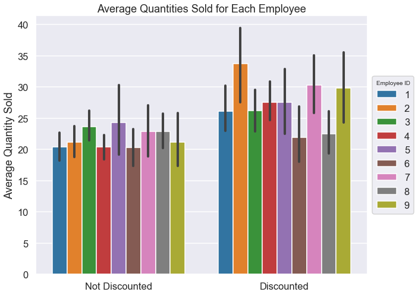
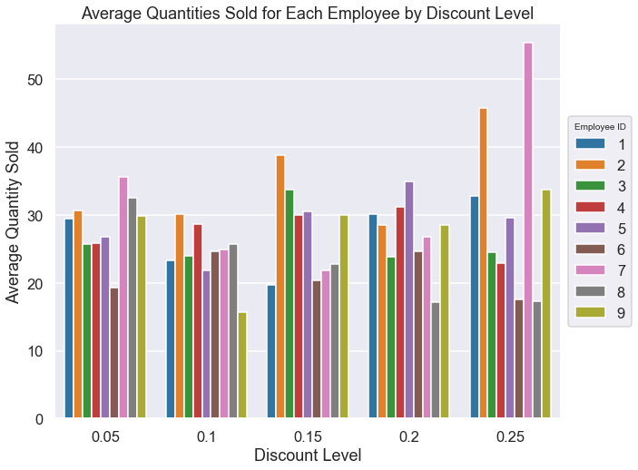
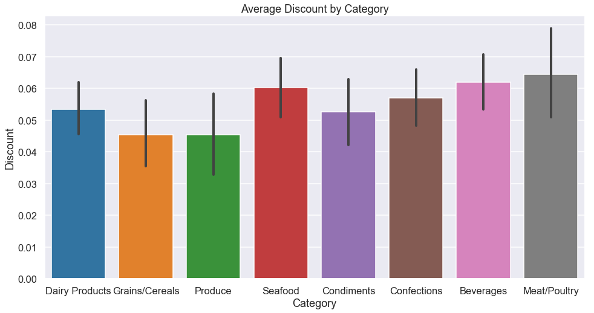

# Hypothesis Testing with the Northwind Database

## Project Overview

The goal of this project is to extract information from the northwind database using SQl and to demonstrate a keen grasp on hypothesis testing procedures. The Northwind Database contains sample sales records for a ficticious company named "Northwind Traders." Below is a schema showing the structure of the northwind database.

The project is broken down into four individual questions and evaluating each question followed a similar pattern. We present the null and alternate hypothesis, explore our data, then perform a hypothesis test to determine an effect. I will briefly outline the project here, but I would suggest looking at the notebook inside this repository as it contains all of my code and shows the process of working with the dataset.

## The Questions

### Does discount amount have a statistically significant effect on the quantity of a product in an order? If so, at what level(s) of discount?

We begin by looking at the effect of discount on the quantity of items that are ordered. This question will be broken down into two hypothesis. The first will test for a significant effect of discount on quantity of items ordered. If that test demonstrates a significant effect, then the second hypothesis will test different discount levels to determine at what levels the effect is noticeable.

#### First Hypothesis

𝐻𝑂 : Discounted orders will have the same quantity of items as non-discounted orders.

𝐻𝐴 : Discounted orders will contain more items than non-discounted orders.

#### The Data and Test

The graphs indicate that there is a difference in the quantity of items ordered when products are discounted. To evaluate if the difference is significant, we used Welch's T-test. We rejected the null hypothesis because our p-value of 5.66e-10 is much lower than our alpha level of 0.05. It appears that discounted orders do have a larger quantity of items ordered. Using Cohen's d, we found our effect size to be 0.286. We have a small, though not inconsequential effect.

#### Second Hypothesis

𝐻𝑂 : The quantity of items ordered will be the same between all discount levels.

𝐻𝐴 : The quantity of items ordered will not be the same between all discount levels.

#### The Data and Test

The graph indicates that there will not be a significant difference between discount levels as the means are very close to each other. To test this hypothesis, we ran a one-way ANOVA. With a p value of 0.61 we could not reject the null hypothesis, and thus we assume all discount levels have a similar effect on quantities ordered.

### Are customers who receive a higher discount more likely to shop with Northwind Traders? How does this vary based on the frequency of orders versus the amount the companies spend?

Next we want to see if returning customers are more likely to get a discount. We will look at two factors of the companies that order from Northwind traders, the number of orders placed and the amount that the company has spent. We will again test two hypotheses for this question looking at how discount levels are affected by these independent variables.

#### First Hypothesis

𝐻𝑂 : All companies will have the same disount level.

𝐻𝐴 : Companies who have more orders will have a higher average discount level.

To test, we ran a one-tailed linear regression. We again used an alpha level of .05.

#### The Data and Test

With a p-value lower than .001 and a positive coefficient, we are able to reject the null hypothesis. Companies with more orders do have a significantly higher average discount rate. We plotted the graph of the regression line to see how strong the correlation is.

With an  𝑅2  of .235, we can see that the number of orders a company has placed with Northwind Traders has a significant, but not necessarily strong effect on discount. The variance in discount level is not adequately explained by our regression model.

#### Second Hypothesis

H𝑂: All companies will have the same disount level.

𝐻𝐴: Companies who have spent more will have a higher discount level.

#### The Data and Test

We also used a one-tailed linear regression analysis for this test, and again we had a p-value less than .001. We can reject the null hypothesis. The amount that a company has spent does have a significant effect on discount level. This is a plot of this model:

This model looks about the same as the first one. Both the  𝑅2 (0.216) and the regression coefficient are smaller than those in the model with order frequency. Overall this model also doesn't explain enough variance in discount levels to have a strong effect.

### Are some employees statistically more likely than others to sell items when discounted? If so, does discount level have an effect?

Next, we wanted to examine how the sales record of discounted items varies between employees. Is our sales team equally good at selling discounted products, or do some employees sell more than others? 

#### Hypothesis

𝐻𝑂 : The quantities of discounted items sold will be the same between employees.

𝐻𝐴 : Different employees will have different quantities of discounted items sold.

#### The Data and Test

It looks like most employees have somewhat improved sales when items are discounted, but some make larger jumps. Lets break this chart down further by looking at each discount level by employee ID.

There are noticeable differences between employees at each discount level. We ran a two-way ANOVA testing the effect of discount level and employee ID on the quantity of items sold with an alpha level of 0.05. With a p-value of 0.01, there is a significant effect between employee ID and the quantity of discounted items sold, but there is not a significant effect for the discount level with a p-value of 0.12.

### Are certain types of items more likely to be discounted?

Finally we took a look at the categories of our products. We tested to see if different categories are more likely to be discounted.

#### Hypothesis

𝐻𝑂 : There will be no differences in discount level between product categories.

𝐻𝐴 : There will be significant differences in discount level between product categories.

#### The Data and Test

The categories seem to have similar discount levels.  To test if there is an effect present, we ran a one-way ANOVA with an alpha level of 0.05.  With a p-value of 0.149, we could not reject the null hypothesis. There is no significant difference in discount levels between types of products.

## Summary

We found that there is a significant effect on the quantity of items ordered when products are discounted; however the level of discount does not have a significant effect.  The effect size of discount on quantity was small.

Customers who order more often from Northwind Traders have a significantly higher discount level; although, the number of orders was not a strong measure of how much of a discount companies received. Similarly, customers who spend more at Northwind Traders have a significantly higher discount level. Again though, the amount spent was not a strong predictor of discount level.

Some employees sell significantly more discounted products than others and this holds true at all discount levels.

There is no significant difference in discount level between categories of products.

What does this mean for Northwind Traders? Discounts are being used to effectively sell products and retain customers. This should lead to increased sales. Differing discount amounts are not affecting quantities of items sold, nor is the size of a discount affecting customer retention strongly. This means that discount levels are not being used effectively. There is no need for a larger discount if a smaller one accomplishes the same goal. Also, employees may need more consistent training as they are showing significantly differences in their sales of discounted projects. Discount levels are spread evenly across product categories, meaning discounts are not being used to strategically target products that Northwind Traders wants/needs to sell. There is room for improvement in the business, and by addresssing these issues we can increase sales and decrease costs.

## Future Work

There are several ways to expand the scope of this project.  First, I would recommend breaking down employee sales records further. I am interested to see if there are other differences between employees such as items sold by category of product. There is a lot of potential information that can be explored here.  Second I would look at the effect of region on sales. There may very well be an effect of region on discount levels, categories of items ordered, or number of orders. And finally, I would also look at finding how discount levels are set.  There are many possible predictors in the database and I am curious to see if any of them strongly correlate with discount level.